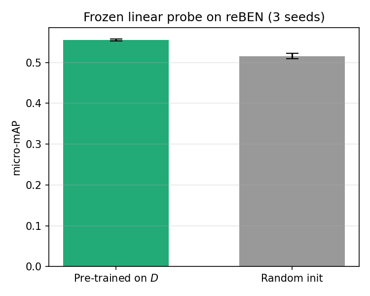

# STRATA-S12 — Evaluation Harness

Evaluation harness and reproducibility layer for **STRATA-S12**, a paired
Sentinel-1 (SAR) / Sentinel-2 (optical) corpus for self-supervised Earth
observation. This repository does **not** contain the corpus or the acquisition
pipeline (see [Data and weights](#data-and-weights) and
[What is not included](#what-is-not-included)); it contains the code that
validates the pre-trained representation reported in the accompanying paper.

The harness runs a **frozen linear probe** on **reBEN** (BigEarthNet v2.0,
19-class multi-label) and compares a ViT-S/16 encoder pre-trained on the
STRATA-S12 corpus against a random-initialised baseline of the same
architecture, over multiple seeds, under a pre-registered acceptance criterion.

> **Status.** This repository accompanies a manuscript currently under review.
> Items marked `TODO` below are filled in at release (DOIs, author metadata,
> funding reference); see [Before publishing](#before-making-this-repository-public).

---

## What this evaluates

The claim under test is simple: *does self-supervised pre-training on the
STRATA-S12 corpus produce a representation that is measurably better than a
random encoder of the same architecture?* The probe answers it with a frozen
encoder and a single trained linear layer, so any difference is attributable to
the representation, not to fine-tuning.

- **Encoder.** ViT-S/16, 6-channel input in corpus band order
  (S2 B4, B3, B2, then S1 VV, VH, VV−VH), MAE pre-training. The probe feature is
  the CLS token (dimension 384). The encoder is frozen throughout.
- **Benchmark.** reBEN / BigEarthNet v2.0, 19-class multi-label. A linear layer
  (384 → 19) is trained with binary cross-entropy; the metric is average
  precision, reported as micro-mAP (primary) and macro-mAP (descriptor).
- **Baseline.** The same architecture with random weights, extracted and probed
  identically. This is the reference the pre-trained encoder must beat.
- **Criterion (pre-registered).** Averaged over seeds, on micro-mAP:

  ```
  mean_pretrained − std_pretrained  >  mean_random + std_random
  ```

  A conservative 1-sigma non-overlap rule. It either holds or it does not; the
  margin is reported.

## Results

Reference numbers reproduced by this harness (3 seeds), stored in
`out/summary.json` and `out/probe_results.json`:

| Metric               | Pre-trained on corpus | Random init       |
| -------------------- | --------------------- | ----------------- |
| micro-mAP (primary)  | 0.5552 ± 0.0022       | 0.5158 ± 0.0068   |
| macro-mAP            | 0.3366 ± 0.0004       | 0.2920 ± 0.0046   |

Criterion on micro-mAP: `0.5530 > 0.5226` → **met**, margin **+0.0304**.



## Repository layout

```
strata-s12-eval-harness/
├── README.md                 # this file
├── LICENSE                   # MIT
├── requirements.txt          # pinned dependencies (paper Section 5.3)
├── model_def.py              # self-contained ViT-S/16 encoder (no training code)
├── reben_loader.py           # reBEN → 6-channel stack + 19-hot labels
├── extract_features.py       # frozen-encoder feature extraction (pretrained + random)
├── linear_probe.py           # linear probe training and mAP evaluation
├── aggregate.py              # applies the criterion; writes table + figure
├── run_probe.py              # end-to-end orchestrator (general entry point)
├── run_probe_local.py        # authors' environment wrapper (see note below)
├── make_paper_assets.py      # regenerates the paper's LaTeX vars/tables/figures
├── in/                       # harness inputs (see in/README.md)
│   ├── README.md
│   ├── norm_stats.json       # per-band normalisation statistics (included)
│   └── config_snapshot.json  # pre-training run configuration (provenance)
└── out/                      # reference outputs that back the paper's numbers
    ├── probe_results.json
    ├── summary.json
    ├── probe_table.tex
    ├── probe_figure.pdf
    └── probe_figure.png
```

> `run_probe_local.py` is the wrapper the authors used on their own
> infrastructure (fixed paths, local staging). It is included for transparency
> about how the reported run was produced. **The portable entry point is
> `run_probe.py`.**

## Requirements

Python 3.10+ and the pinned versions in `requirements.txt`:

```bash
python -m venv .venv
source .venv/bin/activate        # Windows: .venv\Scripts\activate
pip install -r requirements.txt
```

Key packages: `torch==2.4.1`, `timm==1.0.11`, `rasterio==1.4.2`,
`numpy==1.26.4`, `pandas==2.2.3`, `pyarrow==17.0.0`, `scikit-learn==1.5.2`,
`matplotlib==3.9.2`. A CUDA-capable GPU is recommended for feature extraction
but not required.

## Inputs you need to provide

The harness reads two things that are **not** shipped in git:

1. **`in/encoder.pt`** — the pre-trained encoder weights. Download from the
   weights release (see [Data and weights](#data-and-weights)) and place the
   file at `in/encoder.pt`. `in/norm_stats.json` is already included in the
   repository.
2. **reBEN** — the BigEarthNet v2.0 patches and `metadata.parquet`, obtained
   from the official reBEN distribution. Point the harness at them with
   `--reben-root` and `--metadata`.

See `in/README.md` for the exact expected formats.

## Running the harness

Quick smoke test (a few hundred patches, just to check the pipeline runs):

```bash
python run_probe.py \
  --reben-root /path/to/reben \
  --metadata   /path/to/reben/metadata.parquet \
  --max-patches 500
```

Full run as reported in the paper (train capped, test complete, 3 seeds, all 19
classes required):

```bash
python run_probe.py \
  --reben-root /path/to/reben \
  --metadata   /path/to/reben/metadata.parquet \
  --seeds 3 \
  --max-train 40000 \
  --require-classes 19
```

The pipeline has three stages — `features`, `probe`, `aggregate` — run in order
by default. You can run one at a time with `--stage`.

### Outputs

- `features/` — cached frozen features per split and encoder (`.npz`), regenerable.
- `out/probe_results.json` — per-seed micro/macro-mAP and per-class AP.
- `out/summary.json` — aggregated means, stds and the criterion verdict.
- `out/probe_table.tex`, `out/probe_figure.pdf`, `out/probe_figure.png` — the
  table and figure used in the paper.

To regenerate the full set of LaTeX assets for the manuscript from the JSON
results:

```bash
python make_paper_assets.py \
  --summary out/summary.json \
  --results out/probe_results.json \
  --out-root /path/to/paper/repo
```

## Data and weights

The encoder was pre-trained on a stratified, representative subset of the
STRATA-S12 corpus: the first 330 seed-shuffled WebDataset shards (90,403 pairs),
built label-free. Because the shards are seed-shuffled at packing time, any
prefix is a representative draw across all class × season × region strata. This
subset is a training-time repackaging of data already released in the corpus,
not a separate dataset, and is not redistributed on its own.

- **Pre-trained encoder weights** (`encoder.pt`) — archived with the corpus
  record on Zenodo, DOI [10.5281/zenodo.22699047](https://doi.org/10.5281/zenodo.22699047).
  Place at `in/encoder.pt`.
- **STRATA-S12 corpus (D)** — citable record on Zenodo, DOI
  [10.5281/zenodo.22699047](https://doi.org/10.5281/zenodo.22699047); the imagery,
  being multi-terabyte, is hosted on the Hugging Face Hub:
  https://huggingface.co/datasets/chsanleo/strata-s12
- **Class-balanced subset (D_lite)** — Zenodo, DOI
  [10.5281/zenodo.22646277](https://doi.org/10.5281/zenodo.22646277).

The corpus is derived from Copernicus Sentinel-1 and Sentinel-2 data accessed
through Google Earth Engine, and from ESA WorldCover 2021 v200 and Natural Earth
admin-0 boundaries; each is redistributed under its own licence.
## What is not included

The acquisition-side implementation (the DDSA pipeline that builds the corpus)
is **not** redistributed here. It is tied to operational credentials and
infrastructure rather than to the method itself, and the pseudocode and
specification in the paper are detailed enough to reimplement it independently.
This repository is deliberately scoped to *verification of the published
results*, not reproduction of the corpus-production process.

## Citation

If you use this harness or the STRATA-S12 corpus, please cite the accompanying
paper:

```bibtex
@misc{sanchezleon2026strata,
  title   = {{Deficit-Driven Stratified Acquisition for Building STRATA-S12: An Open SAR--Optical Corpus for Self-Supervised Learning}},
  author  = {Sanchez-Leon, Christian and Chen, Dongming and Wang, Dongqi},
  year    = {2026}
}
```

## License

Code is released under the **MIT License** (see `LICENSE`). The STRATA-S12
dataset is released separately under **CC BY 4.0**; the two licences are
independent.

## Contact

Christian Sanchez-Leon, Northeastern University, Shenyang, China —
ORCID `0009-0005-0994-9946`.
